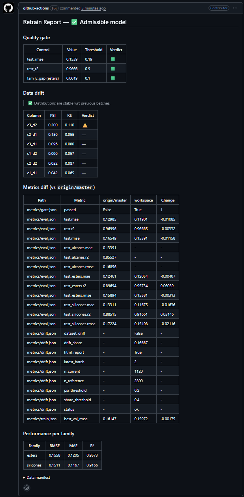
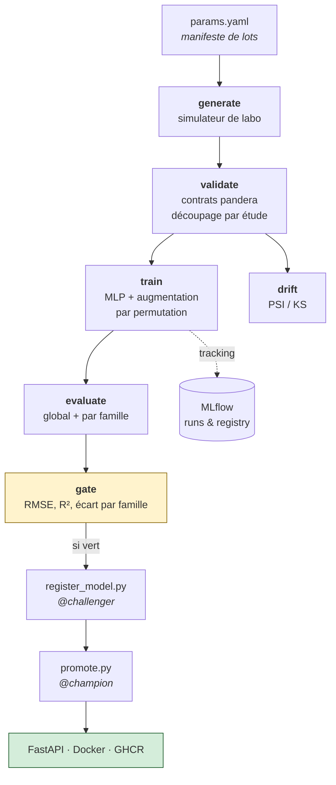
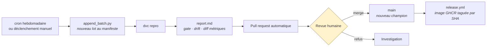
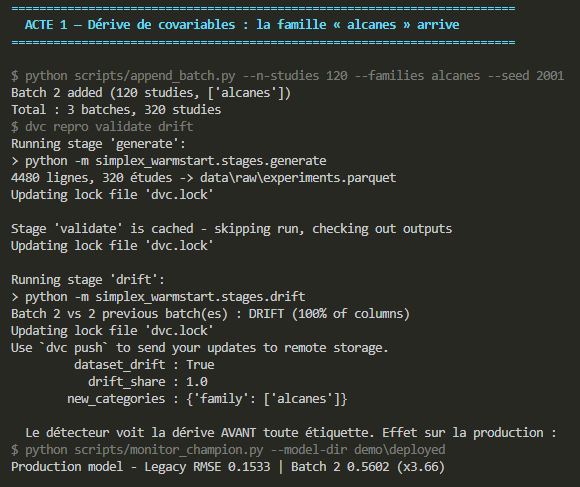
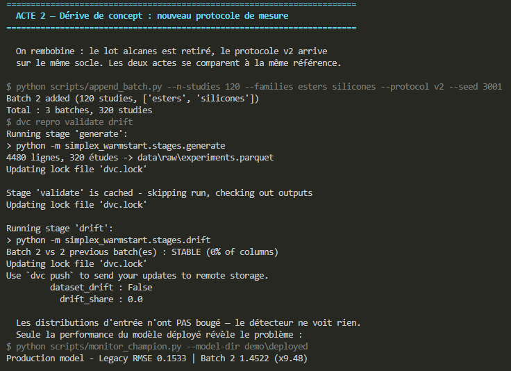
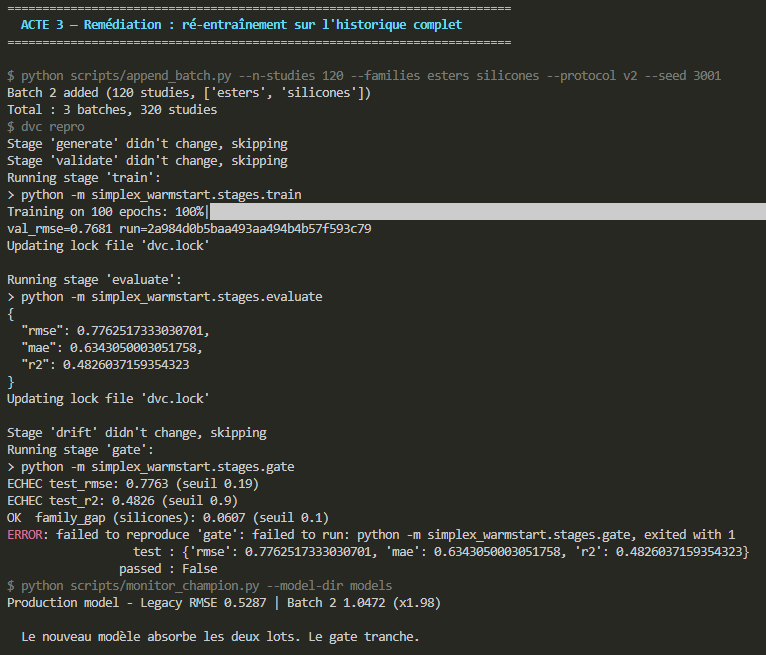

# simplex-warmstart

Système MLOps complet autour d'un problème de plans d'expériences sur mélanges
ternaires : prédire la zone prometteuse d'un simplexe à partir des études passées,
pour éviter un premier plan exploratoire coûteux.

[](…)
[](…)



---

## Résumé

Un modèle qui apprend, ça n'est qu'un début. Ce dépôt implémente ce qui vient
après : données versionnées, pipeline reproductible, tests du *modèle* et pas
seulement du code, seuil de qualité bloquant, registry avec promotion
champion/challenger et rollback, service conteneurisé, détection de drift, et
un retrain automatique qui ouvre une pull request avec son verdict.

**Stack** — uv · DVC · MLflow · PyTorch · pandera · FastAPI · Docker ·
GitHub Actions · Evidently

## Eléments importants

| Fichier | Pourquoi |
| --- | --- |
| [`src/simplex_warmstart/splits.py`](src/simplex_warmstart/splits.py) | Découpage **par étude** : où se cachent les fuites de données |
| [`tests/test_behaviour.py`](tests/test_behaviour.py) | Tests comportementaux : invariance par permutation, effets directionnels |
| [`src/simplex_warmstart/stages/gate.py`](src/simplex_warmstart/stages/gate.py) | Le seuil de qualité qui bloque une promotion |
| [`.github/workflows/retrain.yml`](.github/workflows/retrain.yml) | La boucle de retrain automatique |
| [`resources/adr/`](resources/adr/) | Les décisions d'architecture et leurs raisons |

## Démarrage

```sh
make setup      # environnement verrouillé (uv)
make pipeline   # rejoue les 6 étapes du pipeline
make demo       # rejoue les incidents de drift
make serve      # API locale sur http://127.0.0.1:8000/docs
```

Ou directement l'image publiée :

```sh
docker pull ghcr.io/AymericPalaric/simplex-warmstart:latest
```

## Le problème métier

Un formulateur cherche le meilleur mélange de trois composants. L'espace des
compositions est un simplexe. Un plan d'expériences classique demande une
première campagne pour repérer la zone intéressante, puis une seconde pour
l'affiner — deux fois le coût en paillasse.

J'ai développé un outil (repo privé, pour protéger la PI) local à destination des
laboratoires leur permettant de designer et manipuler sur le simplexe.
Cet outil permettrait donc, au fur et à mesure de ses utilisations par le
laboratoire, d'enregistrer les études ainsi réalisées, pour les capitaliser
ensuite avec du ML --> c'est l'intention du présent projet : un POC d'une future
intégration ML locale.

Ce projet apprend des études passées : à partir des descripteurs des composants
d'une nouvelle étude, il prédit la surface de réponse et propose directement une
zone restreinte. Les données sont **entièrement synthétiques**, produites par un
simulateur de laboratoire dont la vérité terrain est un polynôme de Scheffé.

Ce simulateur est le cœur du projet : il produit des lots au fil du temps et sait
provoquer un drift à la demande. Sans arrivée continue de données, un pipeline
MLOps n'a rien à faire — c'est de la décoration.

## Architecture



## La boucle de retrain



Le manifeste de données vit dans `params.yaml` : chaque retrain y ajoute
un lot. L'historique du jeu de données est donc lisible dans `git log`.

## L'incident, en trois actes

`make demo` rejoue le scénario complet.

**Acte 1 — drift de covariables.** Une famille chimique inédite arrive. Le
détecteur PSI/KS la voit immédiatement, sans avoir besoin d'une seule étiquette.



**Acte 2 — drift de concept.** Le protocole de mesure change. Les distributions
d'entrée sont **inchangées**, le détecteur de drift ne voit rien — et pourtant
le modèle déployé se dégrade d'un facteur 10. Surveiller les features ne suffit
pas : il faut mesurer la performance du modèle en service.



**Acte 3 — remédiation.** Le retrain sur l'historique complet absorbe les
deux lots, la performance n'est plus dégradée que d'un facteur 2. Le seuil de qualité tranche :
en l'état actuel, le model n'est toujours pas assez adapté au nouveau batch (davantage de données
issues du protocole v2, ou un changement d'architecture du modèle seraient peut-être nécessaires).



## Décisions techniques

- **Le drift alerte, la métrique tranche.** Le seuil de qualité ne bloque pas
  sur le drift : ce serait interdire au système d'apprendre quoi que ce soit de
  nouveau. ([ADR-002](resources/adr/0002-non-blocking-gate-on-drift.md))
- **La promotion n'est pas automatique.** La CI produit les preuves, un humain
  merge. ([ADR-004](resources/adr/0004-registry-not-in-dvc.md))
- **La logique de détection de drift est écrite à la main**, Evidently ne sert
  que de couche de visualisation. ([ADR-003](resources/adr/0003-drift-detection.md))
- **`params.yaml` plutôt que Hydra**, pour l'invalidation fine de DVC. ([ADR-001](resources/adr/0001-params-yaml-over-hydra.md))

## Ce que ce projet n'est pas

- Les données sont synthétiques. Le simulateur est calibré pour être apprenable
  et pour drifter à la demande, pas pour être chimiquement réaliste. Les données
  réelles arriveront une fois l'outil officiel massivement utilisé par le laboratoire.
- MLflow tourne en local (SQLite). En production, ce serait un serveur partagé
  avec un stockage d'artefacts distant.
- Pas d'orchestrateur (Airflow, Prefect) : `dvc repro` suffit à cette échelle et
  ne demande aucune infrastructure.
- Pas de Kubernetes, pas de feature store, pas de tests de charge.

## Structure

```
src/simplex_warmstart/   code du paquet (stages/, serving/)
scripts/                 actions hors pipeline (registry, rapports, démo)
tests/                   unitaires, comportementaux, artefact, API
resources/adr/                décisions d'architecture
dvc.yaml, params.yaml    pipeline et paramètres
```

## Licence

[MIT](LICENSE.md).
