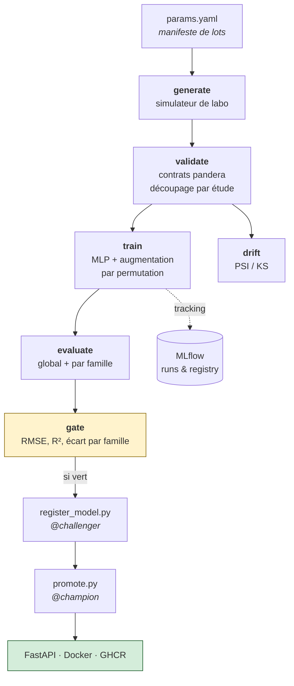
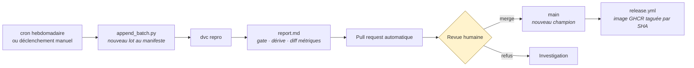

```mermaid
flowchart TD
    P["params.yaml<br/><i>manifeste de lots</i>"] --> G["<b>generate</b><br/>simulateur de labo"]
    G --> V["<b>validate</b><br/>contrats pandera<br/>découpage par étude"]
    V --> T["<b>train</b><br/>MLP + augmentation<br/>par permutation"]
    V --> D["<b>drift</b><br/>PSI / KS"]
    T --> E["<b>evaluate</b><br/>global + par famille"]
    E --> Q["<b>gate</b><br/>RMSE, R², écart par famille"]

    T -.->|tracking| ML[("MLflow<br/>runs & registry")]
    Q -->|si vert| REG["register_model.py<br/><i>@challenger</i>"]
    REG --> PR["promote.py<br/><i>@champion</i>"]
    PR --> API["FastAPI · Docker · GHCR"]

    style Q fill:#fff3cd,stroke:#856404
    style API fill:#d4edda,stroke:#155724
```

```mermaid
flowchart LR
    S["cron hebdomadaire<br/>ou déclenchement manuel"] --> A["append_batch.py<br/><i>nouveau lot au manifeste</i>"]
    A --> B["dvc repro"]
    B --> C["report.md<br/><i>gate · dérive · diff métriques</i>"]
    C --> D["Pull request automatique"]
    D --> H{"Revue humaine"}
    H -->|merge| M["main<br/><i>nouveau champion</i>"]
    H -->|refus| X["Investigation"]
    M --> R["release.yml<br/><i>image GHCR taguée par SHA</i>"]

    style H fill:#fff3cd,stroke:#856404
```
